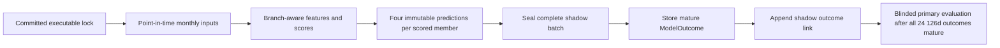

# Shadow Prediction Ledger V1

`claims_eligible=false`

```yaml
ledger_version: shadow-ledger-v1
model_contract: multifactor-v2-hypothesis-contract-v1
status: implementation_ready_not_prediction_authorized
universe: sp500-pit-v1
frequency: monthly
first_scheduled_cohort: 2026-07-31
last_scheduled_cohort: 2028-06-30
scheduled_cohorts: 24
primary_horizon: 126d
product_label_policy: WITHHELD_RESEARCH_ONLY
```

## Decision

The forward ledger is an append-only wrapper around the existing immutable
multi-factor scores, predictions, score drivers, and outcomes. It adds the missing
monthly accountability layer:

- one sealed batch for every scheduled month;
- one scored or explicitly excluded row for every expected point-in-time member;
- exact timestamps, executable-lock hash, input snapshots, feature and score hashes;
- separate internal research fields and withheld product-label fields; and
- append-only outcome links created only after the exact horizon is mature.

The ledger implementation is ready, but Model V2 shadow prediction is not yet
authorized. The current `multifactor-v2-hypothesis-lock-v1.json` is a design lock with
null implementation bindings and `executable_for_shadow_predictions=false`. The CLI
must reject it. A clean executable lock and a stored branch-aware Model V2 score cohort
are required before the first batch.

## Evidence flow



No arrow may be traversed backward. Later data, classifications, restatements, or
outcomes never rewrite an earlier feature, score, prediction, batch, member row, or
outcome link.

## Storage contract

### `shadow_prediction_batches`

One row seals a complete scheduled monthly cohort. Its `batch_hash` covers:

- model version, universe, normalization run, prediction date and timestamp;
- the separate time at which the batch was recorded;
- executable-lock URI and exact file SHA-256;
- locked implementation commit and the later lock/execution commit;
- universe, membership, ticker, feature, and source-snapshot lineage;
- expected, scored, and excluded counts;
- `claims_eligible=false` and the product-label policy; and
- the sorted immutable hashes of every member row.

The invariant is:

```text
expected_member_count = scored_count + excluded_count
```

The unique identity is `(model_version, prediction_date)`. Repeating the command with
identical inputs returns the prior seal. Any changed input, row, timestamp, lock, score,
or hash is a conflict rather than a replacement.

### `shadow_prediction_records`

Every expected non-benchmark point-in-time member appears exactly once.

| Field group | Scored member | Excluded member |
| --- | --- | --- |
| `disposition` | `SCORED` | `EXCLUDED` |
| `research_score` | Required, 0–100 | Null |
| `research_confidence` | Stored when produced | Null |
| `research_label` | Internal research label | Null |
| `product_label` | Always null | Always null |
| `product_label_status` | `WITHHELD_RESEARCH_ONLY` | `WITHHELD_RESEARCH_ONLY` |
| `drivers_json` | Exact family drivers and evidence URIs | Empty |
| `prediction_ids_json` | `21d`, `63d`, `126d`, `252d` | Empty |
| `exclusions_json` | Empty | One or more stable reason records |

Every row also stores the historical ticker, classification branch, membership and
ticker-alias evidence, feature-set and feature-ledger hashes, multi-factor score hash,
and every linked prediction hash. The row hash covers all of those fields.

An exclusion is not a prediction. It preserves cohort accountability without inventing
a score, confidence, driver, product label, or outcome target. An excluded row with no
reason code is rejected.

### `shadow_outcome_records`

An outcome row is a hash-bound link to the existing immutable `ModelOutcome`; it does
not copy or modify the realised values. There may be at most one link per shadow member
and horizon, one link per model prediction, and one link per model outcome.

The link may be appended only when:

1. the shadow member was scored;
2. the requested horizon was bound in the original member row;
3. the linked `ModelOutcome` already exists;
4. its exit date is no later than the link's `recorded_at` date;
5. its `evaluated_at` timestamp is no later than `recorded_at`; and
6. the batch's executable lock authorized the frozen evaluation code.

The existing outcome evaluator remains responsible for proving the exact session count,
aligned benchmark dates, price snapshot timing, delistings, and immutable outcome hash.
The shadow table adds forward-ledger identity and maturity sequencing.

## Timestamp rules

- `prediction_timestamp` is the locked information boundary on the scheduled final
  regular SPY session of the month.
- Every source snapshot used by the batch must have `retrieved_at <=
  prediction_timestamp`.
- Every stored feature and every input named in its lineage must have been model-
  available by `prediction_timestamp`.
- `recorded_at` must be at or after `prediction_timestamp` and is sealed in the batch
  hash.
- The source tree must be clean. The lock's full implementation commit must be an
  ancestor of the running commit, and the executable lock file must be the only path
  changed between them.
- A prediction generated before the scheduled timestamp or reconstructed after outcomes
  are known is invalid, even if its numerical score matches.

## Executable lock required by the CLI

The future JSON lock must include all of the following:

```text
status = EXECUTABLE_LOCKED
claims_eligible = false
executable_for_shadow_predictions = true
executable_for_outcome_evaluation = true
design_lock_sha256 = <SHA-256 of immutable Model V2 design lock>

model.version
model.normalization_version
model.required_horizons = [21d, 63d, 126d, 252d]
model.family_weights = five fixed 0.20 weights
model.required_family_count = 5
model.minimum_component_coverage = 0.80

universe.universe_id = sp500-pit-v1
prediction_schedule.dates = <24 exact dates>
prediction_schedule.sha256 = <canonical date-list hash>

implementation.code_commit = <full clean Git SHA>
implementation.formula_ledger_sha256
implementation.classification_ledger_sha256
implementation.source_manifest_sha256
implementation.evaluation_code_sha256
implementation.report_schema_sha256
implementation.portfolio_notional_usd = <positive fixed notional>
```

The two-commit sequence avoids an impossible self-reference:

1. commit the complete implementation and record that full SHA in
   `implementation.code_commit`;
2. create the executable lock from that committed state; and
3. commit only the executable lock file in a second commit.

At runtime the CLI proves that the implementation commit is an ancestor of `HEAD`, that
the lock bytes equal the copy at `HEAD`, and that no path other than that lock file
changed between the two commits. The batch stores both `code_commit` (the locked
implementation) and `execution_commit` (the commit containing the lock). A feature or
normalization run may identify either commit because their executable source trees are
identical.

The schedule hash is SHA-256 over UTF-8 JSON encoded with sorted keys and compact
separators. The exact ordered date list is:

```text
2026-07-31  2026-08-31  2026-09-30  2026-10-30
2026-11-30  2026-12-31  2027-01-29  2027-02-26
2027-03-31  2027-04-30  2027-05-28  2027-06-30
2027-07-30  2027-08-31  2027-09-30  2027-10-29
2027-11-30  2027-12-31  2028-01-31  2028-02-29
2028-03-31  2028-04-28  2028-05-31  2028-06-30
```

These are the last scheduled regular US equity sessions in the locked window. The
executable lock must bind the list exactly; the dates cannot be recomputed or moved
after the first batch.

## Monthly command

After Model V2 features, branch classifications, normalization, scores, and four
per-security predictions have been stored, seal the cohort with:

```bash
python pipelines/create_shadow_predictions.py \
  --universe-id sp500-pit-v1 \
  --prediction-timestamp 2026-07-31T20:00:00Z \
  --normalization-run-id multifactor-v2-branch-normalization-v1_sp500-pit-v1_2026-07-31 \
  --executable-lock experiments/multifactor-v2-executable-lock-v1.json
```

The command creates the schema additively when required, validates the clean code
revision and executable lock, reconstructs the expected point-in-time cohort, verifies
all stored feature and prediction hashes, and writes the batch plus all member rows in
one transaction. Its output includes the batch ID, batch hash, and reconciled counts.

The command does not calculate outcomes, expose aggregate performance, create a product
label, or publish a recommendation.

## Monthly operating procedure

1. Confirm the date and timestamp are in the committed executable schedule.
2. Acquire and hash the point-in-time source snapshots before the information boundary.
3. Store every expected member's feature row, including explicit missingness.
4. Run the locked branch normalization and Model V2 scoring implementation.
5. Store all four immutable prediction horizons for every scored member.
6. Run `create_shadow_predictions.py` once and retain its batch hash in the operations
   log.
7. Reconcile expected, scored, and excluded counts and review every exclusion reason.
8. Back up the database and source bundles without editing the sealed rows.
9. When each horizon matures, run the existing outcome evaluator and append the matching
   shadow outcome link.
10. Do not generate or inspect aggregate forward-performance reports before the Model V2
    contract's primary evaluation condition is satisfied.

## Required audits

For every monthly batch, the operator must confirm:

- one row per expected member and no duplicates;
- no benchmark row in the ranked cohort;
- no late source, feature, membership, alias, classification, or prediction input;
- every scored member has the same research score, confidence, label, and drivers across
  all four horizons;
- all five families retain 20% weight and minimum component coverage is met;
- every excluded member has component- or eligibility-level reason codes;
- `product_label IS NULL` for every row;
- the stored batch hash reproduces from the sealed inputs; and
- a second identical invocation reports `already_sealed` and creates no rows.

## Failure policy

| Failure | Required behavior |
| --- | --- |
| Design lock or incomplete executable lock supplied | Reject the entire batch. |
| Dirty or different code revision | Reject the entire batch. |
| Date outside the 24-month schedule | Reject the entire batch. |
| Missing or duplicate expected member | Reject the entire batch. |
| Input snapshot or feature available after prediction time | Reject the entire batch. |
| Eligible row missing a family, horizon, driver, or reproducing hash | Reject the entire batch. |
| Excluded row has no reason code | Reject the entire batch. |
| Existing batch differs in any sealed input | Report a conflict; never overwrite. |
| Outcome absent or immature | Store nothing and report not mature. |
| Attempted update or deletion | Reject as an append-only violation. |

A failed scheduled batch remains a failure. Reconstructing it after outcomes become
available would contaminate the forward experiment. The incident must be recorded and
the missing cohort retained in the final completeness report.

## Blinding and claims boundary

Individual mature outcomes may be appended for operational completeness, but no command
in this contract produces aggregate Rank IC, portfolio returns, ablations, or promotion
status. Aggregate forward results remain blinded until all 24 scheduled cohorts have
mature 126-session outcomes and every completeness gate is ready for the single primary
evaluation.

Research scores and labels are internal model evidence. `product_label` is structurally
null and `product_label_status=WITHHELD_RESEARCH_ONLY`. Nothing in the shadow ledger is a
recommendation, suitability determination, portfolio instruction, or authorization for
public performance claims. `claims_eligible=false` remains immutable.
